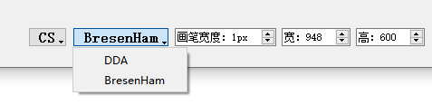
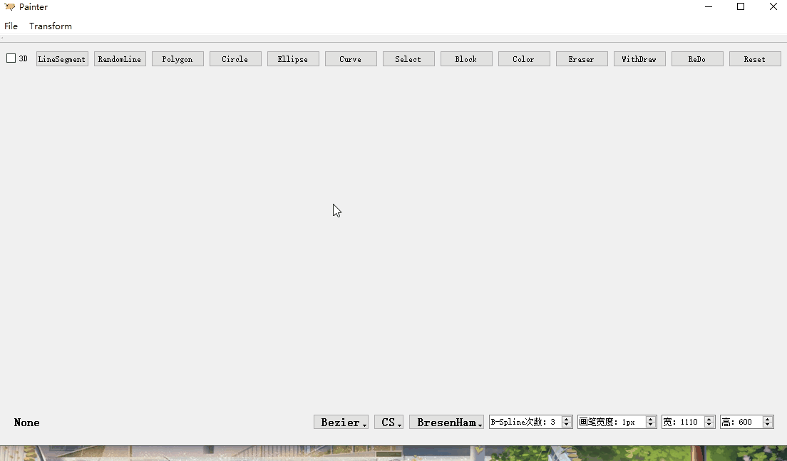

#  系统使用说明书

### `12月增加内容概述`

#### GUI版本

* **功能模式增加**(**GUI版本**)：

    * **曲线(`Curve`)**：添加**`Bezeir`和`B-Spline`**两种曲线绘制方式，至多30个控制点，其中`B-Spline`可以选择**1/2/3**次B样条。并增加曲线的平移，旋转，缩放，复制/粘贴操作。
    * **曲线修改**：在绘制曲线时，鼠标点击并拖动控制点，可以实时修改曲线。

* **功能模式改进**(**GUI版本**)：

    * 在右下角添加**曲线算法选择**和**`B-Spline`次数**选择。

        

* **原代码修改**(**GUI版本**)：
    * **修改`reset()`方法**，以适应曲线的加入。
    * **修复**了当图元**被选中操作时进行撤销**，导致程序崩溃的BUG。修改为：当有图元被选中时，不执行撤销操作。
    * **修复**了当选择的图元被删除后**继续删除**引发的BUG。

#### 控制台版本

* 添加了控制台版本的**曲线算法**。

---

### `11月增加内容概述`

##### <font color=ff0000>GUI部分的具体实现已添加至原框架中！</font>

##### <font color=ff0000>GUI版本操作方式GIF示例见：程序使用说明</font>

#### GUI版本

* **功能模式增加**(**GUI版本**)：
  
    * **选择模式(`Select`)**：鼠标点击选中(多个)图元，便于进行后续的平移，复制等操作。
    * **块选择模式(`Block Select`)**：利用矩形框选中(多个)图元，便于进行后续的平移，复制等操作。
    * **重置画布(`Reset`)**：将画布清空。
    * **平移(`Translation`)**：鼠标拖动平移选中的图元。
    * **旋转(`Rotation`)**：鼠标点击选择旋转中心点，滑动滚轮旋转选中的图元。
    * **缩放(`Scale`)**：鼠标点击选择缩放中心点，滑动滚轮缩放选中的图元。
    * **裁剪(`Crop`)**：鼠标拖动形成矩形裁剪框，实现了`Cohen-Sutherland`和`Liang-Barsky`法裁剪选中的线段。
    * **复制/粘贴(`Copy/Paste`)**：快捷键为`Ctrl+c`，`Ctrl+v`，复制并粘贴选中的图元，并自动转为**平移模式**，便于进行后续操作。
    
* **功能模式改进**(**GUI版本**)：

    * 将线段生成算法和裁剪算法的选择由**提示框选择**转移到**应用右下角**，改为`QToolButton`实现。如下：

        

* **原代码修改**(**GUI版本**)：

    * **析构**函数，**拷贝构**造函数等引发的Bug修复。线段，多边形内部结构更变。
    * 图元增加**`Id`**属性，便于与控制台版本统一。
    * 修改`paintEvent()`等方法以适应修改后的代码。

#### 控制台版本

* 在GUI版本中，提供完整的**控制台版本实现**，**除曲线外**均已实现。

* 使用方式：通过在控制台中给出文件名参数进入控制台模式，若无参数则进入GUI模式。

* 控制台版本代码解析在末尾。

---


### 一. 开发环境说明

* **Windows 1903**
* **QT 5.9.8（MSVC 2015, 32bit）**
    * **Kit: Desktop Qt 5.9.8 MinGW 32bit**
* **Qt Creator 4.8.2**
* **C++ 11**


### 二. 程序使用说明

* <font color=#ff0000 size=4>**在Windows中双击`Executable_File`文件夹下的`Painter.exe`可直接GUI版本绘制！因提交文件夹中名称包含中文(11月报告)，而QT不支持中文路径，故无法直接编译运行，建议使用`Painter.exe`运行！**</font>

* 控制台下**GUI版本**使用方法如下：

    

* 控制台下**控制台版本**使用方式如下：

    

* **主界面如下**：

    

    * **操作图标**如下：

        * **图标**：

            

            

        * **文件操作**：

        

        * **图元操作**：

            

    * #### <font color=#ff0000>**具体操作如下**：</font>

        * **线段，任意线**：**拖动绘制**，**实时显示**。

            

        * **多边形**：**点击绘制**，左键点击持续绘制，**右键点击结束绘制**。

            

        * **圆和椭圆**：点击处为中心，拖动距离产生半径和$r_x$，$r_y$，拖动进行绘制。

            

        * 曲线：
    
            * 点击绘制，**左键点击**选择**控制点**，**右键点击**确定最后的控制点并**结束绘制**。
    
                
    
            * 在绘制途中可以**选择控制点**，并移动以调整曲线。当使用`B-Spline`算法时，进行**局部调整**。
    
                
        
            * `B-Spline`算法中可选择**基函数的次数**，有**1/2/3**次可以选择：
        
                
        
        * **橡皮**：**拖动释放后**经过的图形被擦除。
        
            
        
        * **撤回按钮**：按下则依次撤回画过的图形或笔画。
        
            
        
        * **颜色按钮**：按下则弹出**颜色选择器**进行选择。
        
            
        
        * **重置按钮**：按下则**清屏**。
          
            
            
        * **选择按钮**：按下后可进行**鼠标点选**。
        
            
            
        * **块选择按钮**：按下后可拖动鼠标形成<font color=0000ff>蓝色</font>选择矩形框。选中图元后该图元变为<font color=ff0000>红色</font>(若原来为**红色**则变为**蓝色**)，可同时选中多个图元。如下图：
          
            
            
        * 选择图元后，可进行图元的**平移，旋转，缩放，裁剪，复制，粘贴**操作。
          
            * **平移**：鼠标拖动平移选中的图元。
            
                
            
            * **旋转**：鼠标点击选择旋转中心点，滑动滚轮绕中心点旋转选中的图元。
            
                
            
            * **缩放**：鼠标点击选择缩放中心点，滑动滚轮绕中心点缩放选中的图元。
            
                
            
            * **裁剪**：鼠标拖动形成矩形裁剪框，实现了`Cohen-Sutherland`和`Liang-Barsky`法裁剪选中的线段。
            
                
            
        	* **复制/粘贴**：**快捷键为`Ctrl+c`，`Ctrl+v`**，复制并粘贴选中的图元，并自动转为**平移模式**，便于进行后续操作。
        
                
        
        * 右下角可以更改**画笔宽度**和**界面宽度**。也可以选择**直线算法**和**裁剪算法**。窗口大小改变时，对于数值同步修改。
        
            
        
        * 关闭文件时，若文件已被修改过，则会**提示进行保存**。
        
            


### 三. GUI程序代码说明

1. <font color=#9900ff>**主窗口：`MainWindow`**：</font>

    * 继承`QMainWindow`，**负责有关于应用框架功能的实现并与绘图界面进行交互**。

    - 实现了**新建窗口**与**保存文件**的功能，文件通过**`QImage`**被保存为`.bmp`格式，且可以指定保存路径。

    - 重写`closeEvent()`方法，当关闭窗口时检测图片是否被更改过。若被更改过，则提示应保存文件。

    - 重写`resizeEvent()`方法，实时显示窗口大小，也可以通过**`SpinBox`**设定窗口大小。

    - **定义`paint2DWidget`和`paint3DWidget`**，前者继承`QWidget`，后者为`QOpenGLWidget`类型，分别用于绘制二维和三维图形。目前三维图形的绘制还未开始。可以通过`CheckBox`来切换模式。在三维模式下，各种图形的绘制功能均被停用。

    - 添加**线段，任意线，多边形，圆，椭圆按钮**，按下则变为对应模式，进行绘制；添加**颜色按钮**，用来更变画笔颜色；添加**橡皮按钮**，用以擦除图形；添加**撤回按钮**，用以撤回图形；增加**画笔宽度`SpinBox`**，用来更变画笔宽度；添加**选择，块选择**按钮，用于选择图元，进行后续的操作；添加**平移，旋转，缩放，裁剪**操作。

2. <font color=#9900ff>**图形绘制逻辑**：</font>

    * **基类**：

        * `Graphics`，是每个被绘画实体的基类。拥有如下属性：

        ```cpp
        int id；												   //图元编号
        QVector<QPoint* > points;								//图形所包含的点
        QColor color;											//图形的颜色
        int width;                                              //图形的宽度
        bool isErased;                                          //图形是否已经被删除，用于橡皮擦
        int xMin, xMax, yMin, yMax								//裁剪/块选择边界
        ```

        * 其中每个图形的绘制被实现为它的`points`中的点的绘制，图形中的**主要逻辑是通过`drawLogic()`方法对应算法计算出点坐标并存入`points`中**。

        * `Graphics`拥有以下虚方法，每个派生类均须实现：

        ```cpp
        virtual void drawLogic() = 0;							//绘画逻辑，得到图形中的点坐标
        virtual bool isNotGraphics() = 0;						//判断是否构成对应的图形
        virtual ~Graphics();									//析构，删除图形所有的点坐标
        
        virtual void translation(int xOffset, int yOffset) = 0;         //图元平移
        virtual void rotation(const QPoint* point, int degree) = 0;     //图元旋转
        virtual void scale(const QPoint* point, double times) = 0;      //图元缩放
        virtual bool crop(int xMin, int xMax, int yMin, int yMax, CropAlgorithm curAlg) = 0;    														  //图元裁剪
        ```

    * **派生类**：

        ```cpp
        //派生类类型
        LineSegment												//线段
        RandomLine												//任意线
        Polygon													//多边形
        Circle													//圆
        Ellipse													//椭圆
        ```

        * 任意线`RandomLine`实现方式：鼠标拖动经过的任意两点间均采用**线段**连接。最终的显示效果如同任意的线。

        * 多边形`Polygon`实现方式：鼠标点击的连续两点间采用线段连接。为实现多边形的**按笔画撤回**功能，定义如下属性：

            ```cpp
            QVector<QPoint*> vertexList;                    	//多边形顶点集
            QVector<LineSegment*> lineList;                 	//多边形边集
            int num;                                        	//当前有多少顶点
            ```

            将所有顶点和所有边保存下来，汇总为`points`进行绘制。当需要撤回时，删除对应得边和点即可。

        * **平移**：直接将所有点平移。
        * **旋转/缩放**：将图元的关键点旋转/缩放后重新计算所有点的坐标。
        * **裁剪**：目前只实现了线段的裁剪，通过对应的算法完成。

    * **橡皮擦**：

        * 橡皮擦不属于图形，且全局只有一个，故设计为<font color=#00aaff>**单例模式**</font>

            ```cpp
            //单例实现部分代码：
            class Eraser{
            public:
                static Eraser& getInstance(){					//静态方法获得实例
                    static Eraser eraser;
                    return eraser;
                }
            private:
                Eraser();
                Eraser(const Eraser&);                  		//拷贝构造声明
                Eraser& operator=(const Eraser&);       		//赋值重载声明
            }
            ```

        * 拥有属性**`points`**，记录橡皮擦触碰到的点，并在`paint2DWidget`中将对应点上涉及的图形删除。需要注意：橡皮擦的实现暂时没有采用**任意线**的方式，所以当橡皮擦移动过快时，会导致采样点不连续，导致删除失败。所以<font color=#ff0000>**使用橡皮时需要慢速**</font>！

3. <font color=#9900ff>**2D绘画窗口：`paint2DWidget`：**</font>

    * 拥有以下**关键**属性：

        ```cpp
        Mode curMode;                               			//当前的模式
        QVector<Graphics* > graphicsList;           			//界面上所有的图形
        Graphics* curGraphics;                      			//当前正在画的图形
        Eraser* eraser;                             			//橡皮擦
        ```
        
        **`graphicsList`和`curGraphics`**分别记录了画板上的**已画图形**和**正在画的图形**。类型均为基类指针`Graphics*`，是利用**动态绑定**的特性，用基类管理所有的图形。
        
    * **重写`paintEvent()`方法**，在其中绘制`graphicsList`中所有图形和`curGraphics`，同时若选择了旋转/缩放关键点，也会显示。

    * 监听鼠标**按下**，**移动**，**释放**，**滚轮**事件。
    * 在**按下**时，判断当前的绘画类型，并新建对应的对象(除了多边形)。
        * 在**移动**时，获得当前的位置，并将其存入对应的图形对象中，利用对象的`drawLogic()`方法实时得到当前图形的点坐标。接着调用`update()`函数进行实时绘制(除了多边形)。
        * 若为**平移**，则实时移动对应图元。
            * 若为**裁剪**，则实时改变裁剪窗口。
            * 若为**块选择**，则实时改变选择窗口。
        * 在**释放**时
            * 对于**除多边形外的图形**，表示图形结束绘制，将图行存储到`graphicsList`中，并绘制。
            * 对于**多边形**，每次鼠标释放时判断，若按下的是左键，则正常继续绘制。若按下的是右键，则代表绘制完成，进行结束处理。
            * 对于**橡皮擦**，表示使用完成，调用`eraseGraphics()`方法，依次检测橡皮擦覆盖的点中是否有图形上的点，若有，则将其从`graphicsList`中删除。
            * 对于**旋转和缩放**，选择相应的中心点。
            * 对于**裁剪和块选择**，或执行裁剪/选择操作。
        * 在**滚轮**时
            * 读取滚轮转过的角度，对选中的图元执行对应的旋转/缩放操作。
        
    * **提供`saveTo()`方法**，从`MainWindow`处得到存储的路径和文件名，定义`QImage`对象，将`graphicsList`中的所有图形画到`QImage`中，并保存为.bmp格式。
    
    * **提供`withDraw()`方法**，当前图形类型不是多边形时，删除前一个绘画的图形。当前图形类型为多边形时，删除多边形的前一笔。
    
    * **提供`graphicsCopy()`方法**，若选中了图元，则新建对应的图元。
    
    * **提供`graphicsPaste()`方法**，将新建的图元平移一小段，用于与原图元区分。而后加入列表中，并选中新的图元，将模式改为平移模式，便于后续对新建图元进行平移操作。


### 四. 控制台程序代码说明

* 控制台代码**依托在GUI代码中**。当给出命令文件`input.txt`参数时，**不打开窗口**，将文件名传入**`paint2DWidget`**中，直接绘图，再将结果保存后退出即可。
* 控制台版本无法进行默认输出，使用`ofstream`输出到文件中进行调试。
* 控制台版本<font color=#ff0000>**默认一次只处理一个图元**</font>。

* **实现方式**：

    * 定义**指令结构体**，用于从文件中直接读取所有参数。以裁剪为例：

        ```cpp
        //裁剪指令结构体
        struct Clip{
            int id;										//图元id
            int x1; int y1; int x2; int y2;				//裁剪窗口坐标
            string alg;									//裁剪算法
            friend ifstream& operator>>(ifstream& in, Clip& c) {		//重写读入函数
                in >> c.id >> c.x1 >> c.y1 >> c.x2 >> c.y2 >> c.alg;
                return in;
            }
        };
        //检测出为裁剪指令，进入该函数
        void Paint2DWidget::clipCommand(){
            struct::Clip c;
            fin >> c;									//读入裁剪指令参数
            //以下完成裁剪操作。
            ……
        }
        ```

    * 利用**`map+函数指针`**实现反射的效果，通过指令名直接调用对应的函数。

        ```cpp
        string order;									//每行第一个，表示指令名
        fin >> order;
        while(!fin.fail()){
            (this->*(commandMap[order]))();				//根据指令名直接调用对应的函数
            fin >> order;
        }
        ```