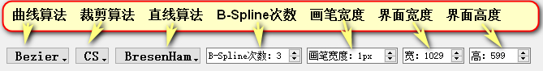

# 系统使用说明书

### 一. 开发环境说明

* **Windows 1903**
* **QT 5.9.8（MSVC 2015, 32bit）**
    * **Kit: Desktop Qt 5.9.8 MinGW 32bit**
* **Qt Creator 4.8.2**
* **C++ 11**


### 二. 代码编译说明

* `qmake.exe Painter.pro -spec win32-g++ "CONFIG+=debug" "CONFIG+=qml_debug"`


### 三. 程序使用说明

* <font color=#ff0000 size=4>**在Windows中双击`Executable_File`文件夹下的`Painter.exe`可直接进行绘制！因提交文件夹中名称包含中文(10月报告)，而QT不支持中文路径，故无法直接编译运行，建议使用`Painter.exe`运行！**</font>

* **主界面如下**：

    

    * 左上角可以**新建文件**和**保存文件**，也可以使用`Ctrl+N`和`Ctrl+S`。

    * 点击3D `CheckBox`，可以在2D和3D间切换，目前还未完成3D部分。

    * 按钮从左至右依次为：**线段，任意线，多边形，圆，椭圆，颜色，橡皮，撤回**。点击对应的按钮，左下角会显示当前的模式，并且可以进行绘制。

    * 点击线段和多边形按钮，会弹出提示框选择算法。默认为**BresenHam**算法。

        

    * <font color=#ff0000>**具体操作如下**：</font>

        * <font color=#ff0000>**线段，任意线为拖动绘制，实时显示。**</font>

        * <font color=#ff0000>**多边形为点击绘制，左键点击持续绘制，右键点击结束绘制。**</font>

        * <font color=#ff0000>**圆和椭圆的点击处为中心，拖动距离产生半径和$r_x，r_y$，拖动进行绘制。**</font>

        * <font color=#ff0000>**橡皮拖动释放后经过的图形被擦除。**</font>

        * <font color=#ff0000>**撤回按钮按下则依次撤回画过的图形或笔画。**</font>

        * <font color=#ff0000>**颜色按钮按下则弹出颜色选择器进行选择。**</font>

            

    * 右下角可以更改**画笔宽度**和**界面宽度**。

    * 关闭文件时，若文件已被修改过，则会提示进行保存。

        


### 四. 程序代码说明

1. <font color=#9900ff>**主窗口：`MainWindow`**：</font>

    * 继承`QMainWindow`，负责有关于应用框架功能的实现并与绘图界面进行交互。

    - 实现了**新建窗口**与**保存文件**的功能，文件通过**`QImage`**被保存为`.bmp`格式，且可以指定保存路径。

        

    - 重写`closeEvent()`方法，当关闭窗口时检测图片是否被更改过。若被更改过，则提示应保存文件。

    - 重写`resizeEvent()`方法，实时显示窗口大小，也可以通过**`SpinBox`**设定窗口大小。

        

    - **定义`paint2DWidget`和`paint3DWidget`**，前者继承`QWidget`，后者为`QOpenGLWidget`类型，分别用于绘制二维和三维图形。目前三维图形的绘制还未开始。可以通过`CheckBox`来切换模式。在三维模式下，各种图形的绘制功能均被停用。

        

        

    - 添加**线段，任意线，多边形，圆，椭圆按钮**，按下则变为对应模式，进行绘制；添加**颜色按钮**，用来更变画笔颜色；添加**橡皮按钮**，用以擦除图形；添加**撤回按钮**，用以撤回图形；增加**画笔宽度`SpinBox`**，用来更变画笔宽度。

        

        

2. <font color=#9900ff>**图形绘制逻辑**：</font>

    * **基类**：

        * `Graphics`，是每个被绘画实体的基类。拥有如下属性：

        ```cpp
        QVector<QPoint* > points;								//图形所包含的点
        QColor color;											//图形的颜色
        int width;                                              //图形的宽度
        bool isErased;                                          //图形是否已经被删除，用于橡皮擦
        ```

        * 其中每个图形的绘制被实现为它的`points`中的点的绘制，图形中的**主要逻辑是通过`drawLogic()`方法对应算法计算出点坐标并存入`points`中**。

        * `Graphics`拥有以下虚方法，每个派生类均须实现：

        ```cpp
        virtual void drawLogic() = 0;							//绘画逻辑，得到图形中的点坐标
        virtual bool isNotGraphics() = 0;						//判断是否构成对应的图形
        virtual ~Graphics();									//析构，删除图形所有的点坐标
        ```

    * **派生类**：

        ```cpp
        //派生类类型
        LineSegment												//线段
        RandomLine												//任意线
        Polygon													//多边形
        Circle													//圆
        Ellipse													//椭圆
        ```

        * 任意线`RandomLine`实现方式：鼠标拖动经过的任意两点间均采用**线段**连接。最终的显示效果如同任意的线。

        * 多边形`Polygon`实现方式：鼠标点击的连续两点间采用线段连接。为实现多边形的**按笔画撤回**功能，定义如下属性：

            ```cpp
            QVector<QPoint*> vertexList;                    	//多边形顶点集
            QVector<LineSegment*> lineList;                 	//多边形边集
            int num;                                        	//当前有多少顶点
            ```

            将所有顶点和所有边保存下来，汇总为`points`进行绘制。当需要撤回时，删除对应得边和点即可。

    * **橡皮擦**：

        * 橡皮擦不属于图形，且全局只有一个，故设计为<font color=#00aaff>**单例模式**</font>

            ```cpp
            //单例实现部分代码：
            class Eraser{
            public:
                static Eraser& getInstance(){					//静态方法获得实例
                    static Eraser eraser;
                    return eraser;
                }
            private:
                Eraser();
                Eraser(const Eraser&);                  		//拷贝构造声明
                Eraser& operator=(const Eraser&);       		//赋值重载声明
            }
            ```

        * 拥有属性**`points`**，记录橡皮擦触碰到的点，并在`paint2DWidget`中将对应点上涉及的图形删除。需要注意：橡皮擦的实现暂时没有采用**任意线**的方式，所以当橡皮擦移动过快时，会导致采样点不连续，导致删除失败。所以<font color=#ff0000>**使用橡皮时需要慢速**</font>！

3. <font color=#9900ff>**2D绘画窗口：`paint2DWidget`：**</font>

    * 拥有以下属性：

        ```cpp
        Mode curMode;                               			//当前的模式
        QColor curColor;                            			//当前选择的颜色
        int curWidth;                               			//当前的宽度
        LineAlgorithm curAlg;                       			//当前线段算法，默认BresenHam
        QVector<Graphics* > graphicsList;           			//界面上所有的图形
        Graphics* curGraphics;                      			//当前正在画的图形
        Eraser* eraser;                             			//橡皮擦
        bool isModified;                            			//画板是否已经被修改
        ```

        其中最重要的是**`graphicsList`和`curGraphics`**，分别记录了画板上的**已画图形**和**正在画的图形**。类型均为基类指针`Graphics*`，是利用**动态绑定**的特性，用基类管理所有的图形。

    * 重写`paintEvent()`方法，在其中绘制`graphicsList`中所有图形和`curGraphics`。

    * 监听鼠标**按下**，**移动**，**释放**事件。
        * 在**按下**时，判断当前的绘画类型，并新建对应的对象(除了多边形)。
        * 在**移动**时，获得当前的位置，并将其存入对应的图形对象中，利用对象的`drawLogic()`方法实时得到当前图形的点坐标。接着调用`update()`函数进行实时绘制(除了多边形)。
        * 在**释放**时
            * 对于除多边形外的图形，表示图形结束绘制，将图行存储到`graphicsList`中，并绘制。
            * 对于多边形，每次鼠标释放时判断，若按下的是左键，则正常继续绘制。若按下的是右键，则代表绘制完成，进行结束处理。
            * 对于橡皮擦，表示使用完成，调用`eraseGraphics()`方法，依次检测橡皮擦覆盖的点中是否有图形上的点，若有，则将其从`graphicsList`中删除。
    * 提供`saveTo()`方法，从`MainWindow`处得到存储的路径和文件名，定义`QImage`对象，将`graphicsList`中的所有图形画到`QImage`中，并保存为.bmp格式。
    * 提供`withDraw()`方法，当前图形类型不是多边形时，删除前一个绘画的图形。当前图形类型为多边形时，删除多边形的前一笔。


### 五. 结果展示

